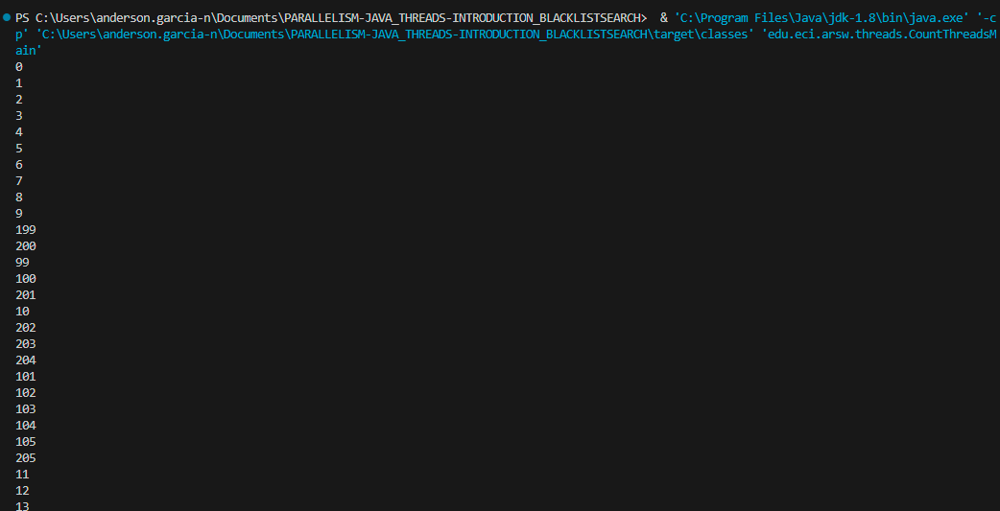
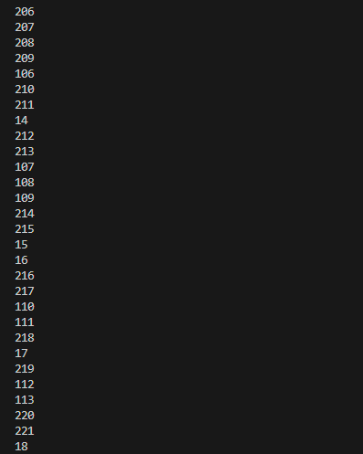
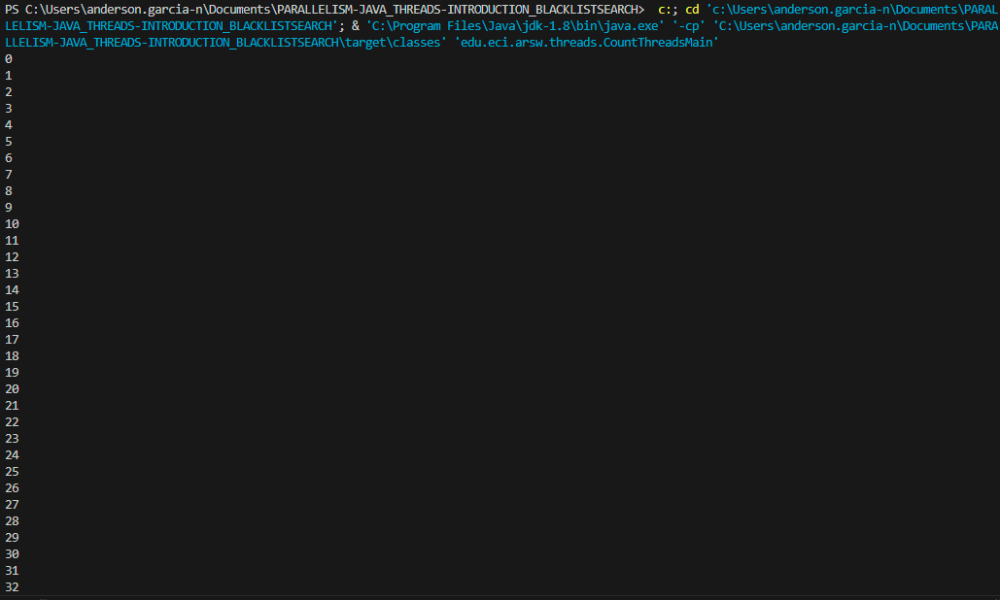
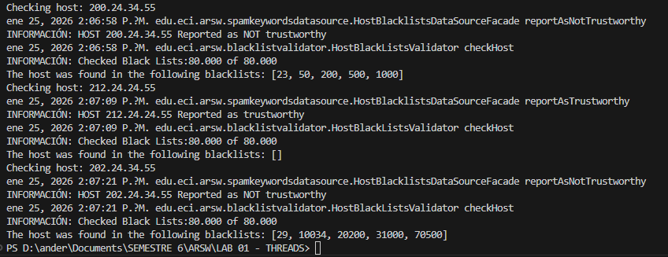
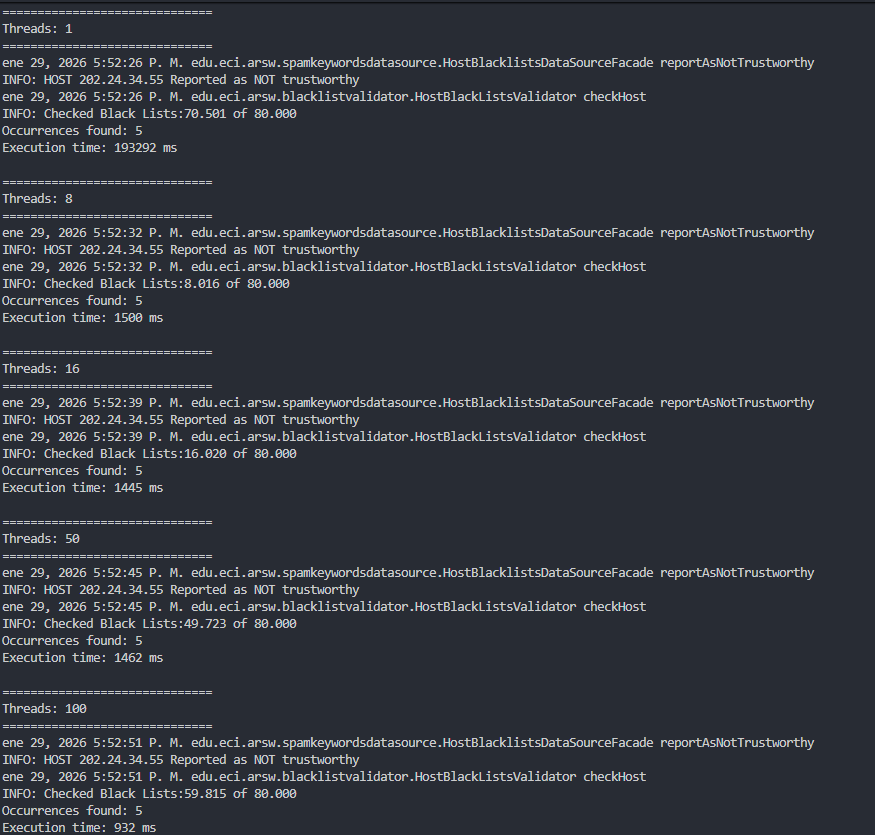
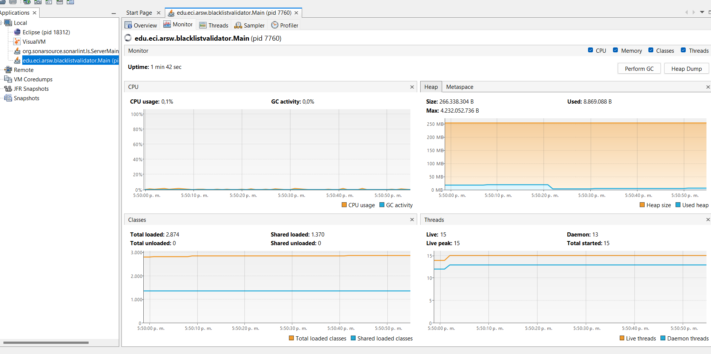
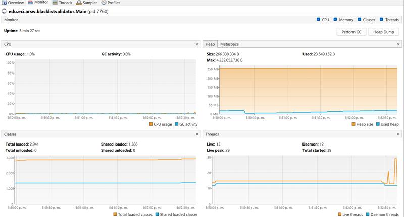
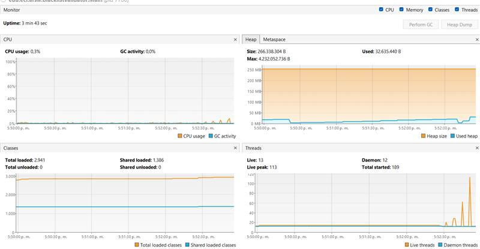
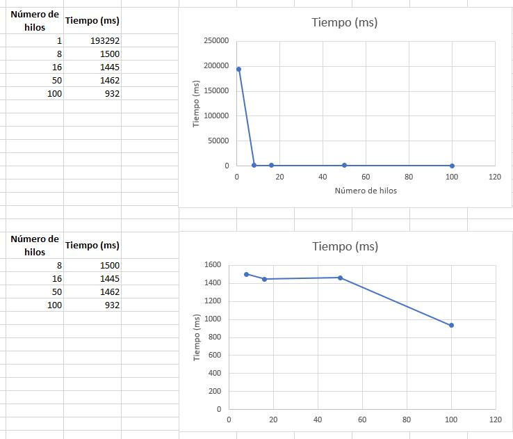

# Escuela Colombiana de Ingeniería
## Arquitecturas de Software - ARSW

# Ejercicio: Introducción al Paralelismo - Hilos - Caso BlackListSearch

## Integrantes
- Anderson Fabián García
- Juana Lozano Chaves

---

## Referencias y Lecturas

- [Threads in Java](http://beginnersbook.com/2013/03/java-threads/) (Hasta 'Ending Threads')
- [Threads vs Processes](http://cs-fundamentals.com/tech-interview/java/differences-between-thread-and-process-in-java.php)

## Descripción

Este ejercicio contiene una introducción a la programación con hilos en Java, además de la aplicación a un caso concreto relacionado con la búsqueda en listas negras de direcciones IP.

---

## Parte I: Introducción a Hilos en Java

### Objetivo
Entender el ciclo de vida de un hilo en Java y las diferencias entre ejecutar código de forma secuencial vs. paralela.

### Tareas

1. **Complete las clases `CountThread`**
   - Defina el ciclo de vida de un hilo que imprima números entre A y B.

2. **Complete el método `main` de `CountMainThreads`**
   - Cree 3 hilos de tipo `CountThread`:
     - Primero: intervalo [0..99]
     - Segundo: intervalo [99..199]
     - Tercero: intervalo [200..299]
   - Inicie los tres hilos con `start()`.

   **Ejecución con `start()`:**
   
   
   
   

   - Cambie a `run()` y observe las diferencias.
   
   **Ejecución con `run()`:**
   
   
   
   

### Análisis: ¿Cómo cambia la salida? ¿Por qué?

**Diferencia Principal:**
- **Con `start()`**: Los hilos se ejecutan de forma intercalada. El scheduler del sistema operativo alterna entre hilos, por lo que las secuencias de números se entremezclan.
- **Con `run()`**: Los hilos se ejecutan de forma **secuencial**. Cada hilo completa su ejecución antes de que comience el siguiente.

---

## Parte II: Ejercicio Black List Search

### Objetivo
Desarrollar un componente que valide direcciones IP contra miles de listas negras de forma paralela.

### Descripción del Problema

Para un software de vigilancia automática de seguridad informática se necesita validar direcciones IP contra varios miles de listas negras (de hosts maliciosos). Se debe reportar aquellas que existan en **al menos 5 listas negras**.

### Componentes del Diseño

El componente está diseñado de la siguiente manera:

**HostBlackListsDataSourceFacade**
- Realiza consultas en cualquiera de las N listas negras registradas
- Método: `isInBlacklistServer()`
- **Thread-Safe** ✓

**HostBlackListsValidator**
- Ofrece el método `checkHost()` que valida un host contra todas las listas negras
- Política: Si el host está en ≥5 listas → "no confiable"
- De lo contrario → "confiable"
- Retorna la lista de números de listas negras donde se encontró el host


### Mensajes de Log

```
INFO: HOST 205.24.34.55 Reported as trustworthy
INFO: HOST 205.24.34.55 Reported as NOT trustworthy
```

### Contexto

El programa de prueba provisto analiza la dirección `200.24.34.55` (registrada en los primeros servidores) en solo algunos segundos. Sin embargo, casos donde el host NO está reportado o está disperso en las listas toma mucho más tiempo.

Este problema es un [problema vergonzosamente paralelo](https://en.wikipedia.org/wiki/Embarrassingly_parallel), ya que no existen dependencias entre particiones del problema.

### Implementación Requerida

1. **Crear la clase `HostBlackListSearchThread`**
   - Representa el ciclo de vida de un hilo que busca en un segmento de servidores
   - Incluir método para obtener ocurrencias encontradas

2. **Modificar el método `checkHost`**
   - Agregar parámetro `N` (número de hilos)
   - Dividir el espacio de búsqueda en N partes
   - Paralelizar la búsqueda con N hilos
   - Usar el método `join()` para esperar a que todos los hilos terminen
   - Agregar ocurrencias de cada hilo
   - Calcular si ≥ BLACK_LIST_ALARM_COUNT para reportar el host

#### Consideraciones Importantes

- Mantener el LOG que informa listas negras revisadas vs. total (debe ser verídico)
- El HOST `202.24.34.55` está disperso en las listas
- El HOST `212.24.24.55` NO está en ninguna lista negra



### Uso de `join()`

Cuando se crean varios hilos, el programa puede terminar antes de que los hilos completen su búsqueda. Por esto usamos `join()`:

✓ Esperar a que todos los hilos terminen su búsqueda  
✓ Recoger resultados parciales de cada hilo  
✓ Combinar información y dar salida final (ej: "Checked 80,000 of 80,000")

---

## Parte II.I: Optimización (Discusión)

### Problema con la Implementación Actual

La estrategia de paralelismo antes implementada es ineficiente en ciertos casos, pues la búsqueda se sigue realizando aún cuando los N hilos (en su conjunto) ya hayan encontrado el número mínimo de ocurrencias requeridas para reportar al servidor como malicioso. Cómo se podría modificar la implementación para minimizar el número de consultas en estos casos?, qué elemento nuevo traería esto al problema?

### Solución Propuesta

Introducir un contador global compartido y una señal de cancelación que permita a los hilos detener cooperativamente la ejecución cuando se alcance el límite.

### Respuestas

**¿Cómo se podría modificar la implementación para minimizar el número de consultas en estos casos?**
Se puede permitir la terminación temprana de la búsqueda en paralelo mediante el uso de un contador global de ocurrencias y una señal compartida que indique a los hilos cuándo deben detenerse, evitando que continúen consultando listas negras innecesariamente una vez alcanzado el límite.

**¿Qué elemento nuevo traería esto al problema?**
 Esta modificación introduce estado compartido y sincronización entre hilos, lo que añade complejidad al problema concurrente y la necesidad de manejar correctamente posibles condiciones de carrera por medio de mecanismos atómicos.

---

## Parte III: Evaluación de Desempeño

### Objetivo
Medir y analizar cómo varía el tiempo de ejecución según el número de hilos utilizados.

### Experimentos

Implementar la siguiente secuencia de experimentos usando direcciones IP dispersas (ej: `202.24.34.55`):

| # | Configuración | Descripción |
|---|---|---|
| 1 | 1 hilo | Ejecución secuencial |
| 2 | N núcleos | Usar `Runtime.getRuntime().availableProcessors()` |
| 3 | 2N núcleos | Doble del número de núcleos |
| 4 | 50 hilos | Configuración intermedia |
| 5 | 100 hilos | Configuración alta |

**Registrar:** Tiempo de ejecución para cada configuración



### Monitoreo con jVisualVM

Ejecutar el monitor jVisualVM durante las pruebas para registrar:
- Consumo de CPU
- Consumo de memoria
- Cantidad de hilos activos







### Resultados Esperados

**Gráfica: Tiempo de Solución vs. Número de Hilos**



**Conclusión:**
La paralelización mejora significativamente el desempeño hasta un número de hilos cercano al número de núcleos. Incrementar excesivamente los hilos genera overhead sin mejoras proporcionales, aunque hay variaciones por terminación temprana y planificación del SO.

---

## Parte IV: Análisis Teórico - Ley de Amdahl

###  Ley de Amdahls


Donde:
- **S(n)** = mejoramiento teórico del desempeño
- **P** = fracción paralelizable del algoritmo
- **n** = número de hilos

### Preguntas de Análisis

#### 1️ ¿Por qué el mejor desempeño NO se logra con 500 hilos?

**Respuesta:**

Según la Ley de Amdahl, el aumento en el número de hilos solo mejora el desempeño en la parte del algoritmo que es paralelizable. En este problema, aunque la consulta a las listas negras puede ejecutarse en paralelo, existen secciones secuenciales que no pueden paralelizarse, como el conteo de ocurrencias, la verificación del umbral (5 listas) y el reporte del host como no confiable.

Al aumentar el número de hilos a valores muy altos (por ejemplo, 200 o 500), el tiempo de ejecución deja de mejorar significativamente e incluso puede empeorar. Esto se debe a:

* Sobrecosto de gestión de hilos (creación, planificación y sincronización).
* Contención por recursos compartidos, como estructuras de datos sincronizadas y el acceso al logger.
* Cambios frecuentes de contexto del sistema operativo.

En comparación, al usar 200 hilos se obtiene un desempeño similar al de 500 hilos, pero con menor sobrecosto. Esto demuestra que, a partir de cierto punto, aumentar el número de hilos no produce mejoras apreciables, confirmando el límite teórico impuesto por la Ley de Amdahl.

#### 2️ Comparación: N Núcleos vs. 2N Núcleos

**Con N hilos (igual a núcleos disponibles):**
Uso eficiente del hardware  
Cada hilo se ejecuta en un núcleo sin competencia excesiva  
Tiempo de ejecución cercano al óptimo

**Con 2N hilos (doble de núcleos):**
Sin mejora significativa (a veces empeora)  
Los hilos adicionales compiten por los mismos núcleos  
Aumento de cambios de contexto y latencia  
jVisualVM muestra picos de hilos activos sin aumento proporcional de CPU

#### 3️ Escenarios Distribuidos

Si en lugar de usar 100 hilos en una sola CPU se utilizara 1 hilo en cada una de 100 máquinas distintas, la Ley de Amdahl se aplicaría de forma más efectiva. Esto se debe a que cada hilo tendría recursos físicos independientes, eliminando la competencia por CPU, caché y memoria, y reduciendo el sobrecosto de sincronización local.

Sin embargo, al distribuir la ejecución también aparecen nuevos factores, como:

* Costos de comunicación entre máquinas.
* Latencia de red.
* Coordinación de resultados parciales.

Si en lugar de esto se usaran c hilos en 100/c máquinas, donde c es el número de núcleos por máquina, el desempeño podría mejorar aún más, ya que se aprovecharía tanto el paralelismo intra-máquina como el paralelismo distribuido, manteniendo un balance adecuado entre uso de CPU y costos de comunicación.

En este escenario, aunque la Ley de Amdahl sigue imponiendo un límite teórico, el valor de la fracción paralelizable efectiva del sistema aumenta, permitiendo una mejor escalabilidad que en una sola máquina.


